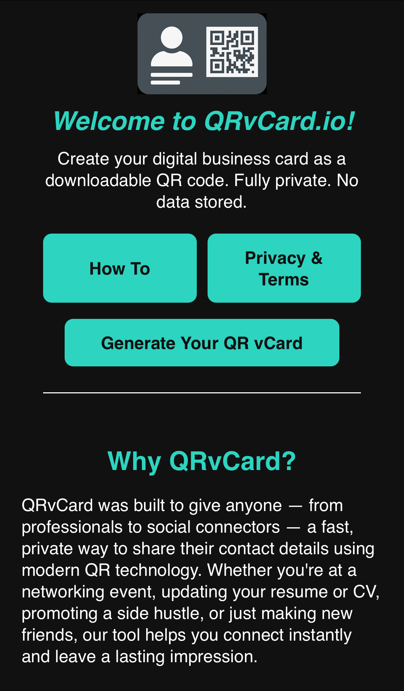

# QRvCard.io — Privacy-First QR vCard Generator

QRvCard.io lets you **generate and download a digital business card as a QR code** — fast, simple, and privacy-first.  
All contact details are processed **locally in your browser**, never uploaded or stored.

---

## 🔐 Privacy First

QRvCard.io is built on a clear principle: **your contact details belong to you**.

- 100% **client-side processing**  
- **No accounts or sign-ups**  
- **No server-side storage**  
- **No tracking by default**  
- Optional analytics/ads load **only after explicit consent**

Your vCard is generated directly inside your device’s browser and never sent anywhere.

---

## 📄 Pages Included

QRvCard.io is a static, self-contained website consisting of:

- `index.html` — Homepage & introduction  
- `about.html` — Mission, how it works, roadmap  
- `how-to.html` — Step-by-step guide  
- `generate.html` — Interactive QR vCard generator  
- `privacy.html` — Privacy Policy & Terms  
- `contact.html` — Contact & feedback form  
- `ads.txt` — Required for authorised ads (if enabled)  
- `sitemap.xml` — Search engine indexing  
- `robots.txt` — Crawl rules  

---

## 🚀 Usage

1. Open **generate.html**  
2. Enter your details  
   - *Full Name* and *Email* are required  
   - All other fields are optional  
3. Customise your QR code  
   - Colour options  
   - Logo upload  
   - Optional label text  
4. Click **Generate QR vCard**  
5. Download the ZIP file containing:
   - `QRCode.png` — your QR image  
   - `Contact.vcf` — your vCard contact file  

All generation is done locally. Nothing is sent to any server.

---

## 🍪 Consent & Cookies

QRvCard.io includes a lightweight, privacy-respecting consent system:

- Shown on first visit  
- Allows enabling **analytics** and/or **ads**  
- Keeps third-party scripts blocked until consent is provided  
- Stores preferences using localStorage  

When Google AdSense is approved, you can replace the banner with Google’s **Privacy & Messaging (CMP)**.  
EU/UK/CH visitors will automatically see a certified consent prompt.

Users can reset their choices anytime via **Cookie settings** in the footer.

---

## 🧱 Technologies

QRvCard.io is built without frameworks using small, reliable libraries:

- **HTML5 / CSS3 / Vanilla JavaScript**  
- **QRCode.js** — QR code generation  
- **JSZip** — Bundles contact + QR into a zip  
- **Formspree** — Handles the contact form  
- **LocalStorage** — Saves consent preferences  

All processing happens client-side.

---

## 📁 Project Structure